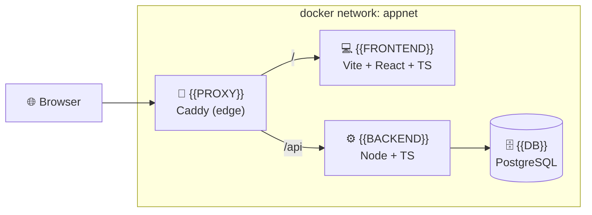

# 🐳 DebForge — Container-First Fullstack Dev Environment (Cross-Platform Edition)

> A single source of truth for spinning up an identical fullstack development environment on **Windows**, **macOS**, and **Linux** — reproducible, production-parity, and "clone + one command" fast. The reference host/server OS is **Debian 13 "trixie" (stable)**.

**Legend:** 💡 tip · ⚠️ warning · ✅ verify · 🪟 Windows · 🍎 macOS · 🐧 Linux

> 💡 **Note:** Placeholders like `{{FRONTEND}}` mark **swappable** stack choices. The concrete stack shown (Vite + React + TS, Node + TS, PostgreSQL, Caddy) is illustrative — every *principle* here is stack-agnostic; only the *commands* are concrete so they stay runnable. Swap the parts, keep the structure.

---

## 📑 Table of Contents

1. [📖 Overview & Philosophy](#-overview--philosophy)
2. [⚡ Quickstart (TL;DR)](#-quickstart-tldr)
3. [✅ Prerequisites](#-prerequisites)
4. [🐧 Host Setup on Debian trixie](#-host-setup-on-debian-trixie)
5. [🖥️ Cross-Platform Onboarding](#️-cross-platform-onboarding)
6. [🗂️ Project Structure](#️-project-structure)
7. [📦 Dockerfiles](#-dockerfiles)
8. [🧩 Compose Files](#-compose-files)
9. [🔐 Environment & Secrets](#-environment--secrets)
10. [🔁 Daily Dev Workflow](#-daily-dev-workflow)
11. [♻️ Reproducibility Guardrails](#️-reproducibility-guardrails)
12. [🚀 Dev/Prod Parity & Deployment](#-devprod-parity--deployment)
13. [🛠️ Task Runner Reference](#️-task-runner-reference)
14. [🧯 Troubleshooting](#-troubleshooting)
15. [📋 New-Hire Checklist](#-new-hire-checklist)

---

## 📖 Overview & Philosophy

**Why container-first?** Because the machine a developer sits at should not decide whether the app runs. The classic failure mode — *"works on my machine"* — happens when the app depends on things scattered across a host: a specific Node version, a locally-installed Postgres, an OpenSSL quirk, a `PATH` entry someone set two years ago. Containers move **all** of that into an image that is built from a recipe (`Dockerfile`) and pinned to exact versions. The host becomes almost boring: it needs only **Docker + Git + an editor**.

That single decision delivers the four goals:

| Goal | How container-first delivers it |
|---|---|
| 🌐 **Cross-platform standard** | The same images and `docker compose` commands run identically on 🪟 / 🍎 / 🐧. The OS differences collapse into "how you run the Linux VM," handled once during onboarding. |
| ♻️ **Reproducible** | Images are pinned **by digest**, dependencies are locked in committed lockfiles, and the whole recipe is version-controlled. Same inputs → same environment, on any machine, next year. |
| 💻 **Works on my machine** | A new hire runs `git clone` + `make up`. No language runtimes to install, no version juggling. |
| 🚀 **Works in prod** | Dev and prod build from the **same base images** and the **same Dockerfile stages**. Config comes from the environment (12-factor), so promoting an image to prod changes *configuration*, not *code paths*. |

> 💡 **Tip:** The mental shift is "**the container is the unit of truth**, the host is just a Docker runtime." Once you internalize that, most OS-specific pain disappears.

### Mental model

A minimal fullstack topology: the browser hits an **edge proxy**, which routes to the **frontend** and the **API**; the API talks to the **database**. In dev, everything is one Compose project on one network.



ASCII fallback (same topology):

```text
  🌐 Browser
     │
     ▼
  🔀 proxy (Caddy)  ──/──►  💻 web  (Vite/React)
     │
     └──────────/api──────► ⚙️ api  (Node/TS) ──► 🗄️ db (Postgres)

  └───────────── docker network: appnet ─────────────┘
```

Each box is a container. Each arrow is a network call over the internal Compose network, addressed by **service name** (`api`, `db`, `web`) — not `localhost`.

---

## ⚡ Quickstart (TL;DR)

**The impatient path.** Assumes Docker + Git already work (see [Prerequisites](#-prerequisites) if not).

```bash
# 1. Clone INTO your native/Linux filesystem (not /mnt/c on Windows — see onboarding)
git clone https://example.com/your-org/your-app.git
cd your-app

# 2. Create your local env from the committed template
cp .env.example .env

# 3. Build + start everything (frontend, api, db, proxy) in the background
make up

# 4. Follow logs until healthy
make logs
```

✅ **Verify:** open <http://localhost:8080> — you should see the frontend, and <http://localhost:8080/api/health> should return `{"status":"ok"}`.

```bash
# Tear down when done (keeps volumes/data)
make down
```

> 💡 **Tip:** No `make`? Every target maps to a plain `docker compose` command — see the [Task Runner Reference](#️-task-runner-reference). You never *need* `make`; it's just ergonomics.

---

## ✅ Prerequisites

You need three things on the host, and **nothing else** (no Node, no Python, no Postgres — those live in containers):

| Requirement | 🪟 Windows | 🍎 macOS | 🐧 Linux |
|---|---|---|---|
| **Container runtime** | Docker Desktop **or** Docker Engine inside WSL2 | Docker Desktop **or** Colima / Rancher Desktop | Docker Engine (CE) — native |
| **Git** | Inside WSL2 Debian | Xcode CLT or Homebrew | distro package |
| **Editor** | VS Code + *Remote – WSL* / *Dev Containers* | VS Code / any | VS Code / any |
| **Shell** | WSL2 Debian shell (bash) | zsh/bash | bash |
| **`make`** (optional) | in WSL2 | `xcode-select --install` | `apt install make` |

Baseline versions (anything newer is fine):

- Docker Engine **≥ 26** with **Compose v2** (the `docker compose` subcommand — *not* the old hyphenated `docker-compose`).
- Git **≥ 2.40**.
- On Windows: **WSL2** (WSL1 is not supported).

✅ **Verify** the runtime is healthy anywhere:

```bash
docker version --format '{{.Server.Version}}'   # prints a version, e.g. 27.x
docker compose version                          # "Docker Compose version v2.x"
docker run --rm hello-world                      # prints "Hello from Docker!"
```

> ⚠️ **Warning:** If `docker compose version` errors but `docker-compose version` works, you're on the deprecated v1 plugin. This guide uses **v2 only**. Install the `docker-compose-plugin` package (covered below) and always type `docker compose` (space, not hyphen).

---

## 🐧 Host Setup on Debian trixie

**Why the official Docker repo and not `apt install docker.io`?** Debian's `docker.io` package lags upstream, doesn't ship the modern **buildx**/**Compose v2** plugins in the versions we want, and mixes poorly with BuildKit features we rely on for reproducible builds. We install **Docker CE from Docker's official APT repository** so dev and prod hosts run the same, current engine.

> 💡 **Note:** These steps target a **Debian trixie** host or server. On 🪟 Windows the *same steps run inside your WSL2 Debian distro* (see [Onboarding](#️-cross-platform-onboarding)). On 🍎 macOS you typically use Docker Desktop/Colima instead of an APT install.

### 1. Remove any conflicting distro packages (idempotent)

```bash
for pkg in docker.io docker-doc docker-compose podman-docker containerd runc; do
  sudo apt-get remove -y "$pkg" 2>/dev/null || true
done
```

### 2. Add Docker's official GPG key and APT repository

```bash
sudo apt-get update
sudo apt-get install -y ca-certificates curl gnupg

# Keyring dir (idempotent)
sudo install -m 0755 -d /etc/apt/keyrings

# Docker's GPG key
sudo curl -fsSL https://download.docker.com/linux/debian/gpg \
  -o /etc/apt/keyrings/docker.asc
sudo chmod a+r /etc/apt/keyrings/docker.asc

# Add the repo, auto-detecting the codename (trixie)
echo \
  "deb [arch=$(dpkg --print-architecture) signed-by=/etc/apt/keyrings/docker.asc] \
  https://download.docker.com/linux/debian \
  $(. /etc/os-release && echo "$VERSION_CODENAME") stable" \
  | sudo tee /etc/apt/sources.list.d/docker.list > /dev/null
```

> 💡 **Note:** On a brand-new trixie release, Docker's repo occasionally publishes the `trixie` suite a little after the OS ships. If `apt-get update` 404s on the Docker repo, temporarily replace `$(. /etc/os-release && echo "$VERSION_CODENAME")` with the previous stable codename `bookworm` — the packages are compatible — and switch back once `trixie` is published.

### 3. Install Docker Engine, CLI, containerd, Buildx & Compose v2

```bash
sudo apt-get update
sudo apt-get install -y \
  docker-ce docker-ce-cli containerd.io \
  docker-buildx-plugin docker-compose-plugin
```

### 4. Add your user to the `docker` group (run Docker without `sudo`)

```bash
sudo groupadd docker 2>/dev/null || true
sudo usermod -aG docker "$USER"
# Apply the new group WITHOUT logging out (or just open a new shell):
newgrp docker
```

> ⚠️ **Warning:** Membership in `docker` is effectively **root-equivalent** (you can bind-mount `/` into a container). That's fine on a personal dev box; on shared servers, prefer rootless Docker or restricted access.

### 5. Enable & start the service; confirm BuildKit/buildx

```bash
sudo systemctl enable --now docker
docker buildx version           # buildx present
docker buildx create --use --name devbuilder 2>/dev/null || docker buildx use devbuilder
```

BuildKit is the default builder in modern Docker; we make it explicit for reproducible, cached builds. Belt-and-suspenders, you can also set it in the daemon config:

```bash
echo '{ "features": { "buildkit": true } }' | sudo tee /etc/docker/daemon.json
sudo systemctl restart docker
```

### ✅ Verify the whole host

```bash
docker run --rm hello-world
docker compose version
docker buildx ls
id -nG | tr ' ' '\n' | grep -q docker && echo "✅ in docker group"
```

### 🧱 Debian trixie realities you should know

| Topic | What's true on trixie | Why you care |
|---|---|---|
| **Repo choice** | Use Docker's **official** repo, not `docker.io`. | Current engine + buildx + Compose v2, matching prod. |
| **cgroup v2** | trixie uses **cgroup v2** (unified hierarchy) by default. | Docker CE supports it natively — good. Resource limits (`cpus`, `mem_limit`) behave correctly. If you run *ancient* tooling that needs cgroup v1, you'd add `systemd.unified_cgroup_hierarchy=0` to the kernel cmdline — **but don't**; stay on v2. |
| **iptables-nft** | trixie uses the **nftables** backend (`iptables` is `iptables-nft`). | Docker CE works with nft. If container networking misbehaves after upgrades, ensure `iptables` points at the nft backend: `sudo update-alternatives --config iptables` → pick `iptables-nft`. Avoid mixing legacy `iptables-legacy` rules with Docker's nft chains. |
| **firewalld/ufw** | If you enable a host firewall, Docker punches its own nft rules. | Docker bypasses `ufw` by default for published ports. Don't assume `ufw deny` protects a published container port — bind sensitive ports to `127.0.0.1` in Compose instead. |

---

## 🖥️ Cross-Platform Onboarding

The goal: **an identical Linux container experience** regardless of laptop. The only real difference is *how the Linux kernel that runs your containers is provided*.

### 🪟 Windows — via WSL2 (Debian inside WSL)

**Why WSL2?** It gives you a real Linux kernel and a native Linux filesystem. Docker runs Linux containers there with near-native performance — *if* your code lives inside the Linux filesystem.

**1. Install WSL2 + Debian** (PowerShell as Administrator):

```powershell
wsl --install -d Debian
wsl --set-default-version 2
wsl --update
```

✅ **Verify:** `wsl -l -v` shows `Debian` with `VERSION 2`.

**2. Inside the Debian WSL shell**, run the entire [Host Setup on Debian trixie](#-host-setup-on-debian-trixie) section (official Docker repo, buildx, group). Alternatively install **Docker Desktop for Windows** and enable *Settings → Resources → WSL Integration* for your Debian distro — either works; the reference path is Engine-in-WSL.

**3. 🔑 Keep the repo INSIDE the Linux filesystem.** Clone into `~/` (e.g. `/home/you/work/`), **not** `/mnt/c/...`.

```bash
# ✅ DO — fast, correct file events, native inode semantics
cd ~ && git clone https://example.com/your-org/your-app.git

# ❌ DON'T — /mnt/c crosses the Windows↔Linux boundary: slow I/O + broken file-watching
# cd /mnt/c/Users/you/... && git clone ...
```

> ⚠️ **Warning:** Bind mounts over `/mnt/c` are **dramatically slower** and hot-reload watchers (inotify) often miss events, so your dev server won't refresh. Keeping code in the Linux FS is the single biggest Windows performance lever.

**4. Edit with VS Code Remote:** install the **WSL** extension, then from the repo run `code .` — VS Code attaches into WSL and edits the Linux-side files directly.

> 💡 **Tip:** Access WSL files from Windows Explorer via `\\wsl$\Debian\home\you\...` when you need to, but *do your Git and Docker work from the WSL shell*.

### 🍎 macOS — Docker Desktop or Colima/Rancher Desktop

macOS can't run Linux containers natively, so a lightweight Linux VM does. Pick one:

| Option | Install | Notes |
|---|---|---|
| **Docker Desktop** | `brew install --cask docker` | Easiest; GUI; enable **VirtioFS** in *Settings → General* for fast bind mounts. |
| **Colima** | `brew install colima docker docker-compose` then `colima start --vm-type vz --mount-type virtiofs` | Lightweight, CLI-first, free. `--vm-type vz` + VirtioFS = best file-sharing perf. |
| **Rancher Desktop** | `brew install --cask rancher` | GUI, choose the **dockerd (moby)** engine, enable VirtioFS. |

✅ **Verify:** `docker context ls` and `docker run --rm hello-world`.

> ⚠️ **Warning — bind-mount performance:** the macOS↔VM boundary makes bind mounts slower than native Linux. Mitigate by (a) enabling **VirtioFS** (huge win), and (b) for hot code paths adding the `:cached` mount consistency flag in Compose (see [Compose Files](#-compose-files)). Keep `node_modules` in a **named volume**, not a bind mount, so dependency I/O stays inside the VM.

### 🐧 Linux — native

You already run the same kernel your containers use — the fast path. Just follow [Host Setup on Debian trixie](#-host-setup-on-debian-trixie). On non-Debian distros, use the equivalent official Docker repo for your distro (Docker publishes repos for Ubuntu, Fedora, etc.). **Do not assume Docker Desktop on Linux** — native Engine is the reference and is faster.

✅ **Verify:** `docker run --rm hello-world` works **without** `sudo`.

### At-a-glance

| Concern | 🪟 Windows (WSL2) | 🍎 macOS | 🐧 Linux |
|---|---|---|---|
| Where code lives | Linux FS (`~/`), **never** `/mnt/c` | native macOS FS + VirtioFS | native |
| Bind-mount speed | native (in WSL FS) | good with VirtioFS; use `:cached` | native (fastest) |
| Runtime | Engine-in-WSL or Docker Desktop | Docker Desktop / Colima / Rancher | Docker Engine CE |
| Gotcha | `/mnt/c` slowness, clock drift | mount consistency | docker group membership |

---

## 🗂️ Project Structure

A clean, annotated tree. Everything a new hire needs is committed; only real secrets and local state are ignored.

```text
your-app/
├── .dockerignore              # keeps build context small & builds reproducible
├── .gitattributes             # enforces LF line endings across OSes
├── .gitignore                 # ignores .env, node_modules, build output
├── .env.example               # ✅ committed template of every required var (no secrets)
├── .env                        # 🔐 git-ignored, real local values (NEVER committed)
├── Makefile                   # task runner: make up/down/logs/exec/... (swappable: justfile)
├── docker-compose.yml         # base topology: services, network, volumes (shared dev+prod)
├── docker-compose.override.yml# 🧑‍💻 DEV overrides: bind mounts, hot reload, exposed ports
├── docker-compose.prod.yml    # 🚀 PROD overrides: prod targets, no source mounts, limits
├── Caddyfile                  # {{PROXY}} config (swappable: traefik.yml / nginx.conf)
├── db/
│   └── init/                  # optional SQL run on first DB init
├── apps/
│   ├── web/                   # {{FRONTEND}} — Vite + React + TS
│   │   ├── Dockerfile         # multi-stage: deps → dev → build → prod
│   │   ├── package.json
│   │   ├── package-lock.json  # ♻️ committed lockfile (pinned deps)
│   │   └── src/
│   └── api/                   # {{BACKEND}} — Node + TS
│       ├── Dockerfile         # multi-stage: deps → dev → build → prod
│       ├── package.json
│       ├── package-lock.json  # ♻️ committed lockfile
│       └── src/
└── docs/
    └── dev-environment.md     # 📖 this document
```

> 💡 **Tip:** A monorepo layout (`apps/web`, `apps/api`) keeps one clone = whole system, which is exactly what goal #3 ("clone + one command") wants. Swap in `packages/`, `services/`, or a polyrepo if your org differs — the Compose wiring stays the same.

---

## 📦 Dockerfiles

**Principles baked into every image:**

- **Multi-stage** — one Dockerfile, several `FROM` stages. Dev target has toolchains + source mounts; prod target is a tiny runtime with only built artifacts.
- **Pinned by tag *and* digest** — never `latest`. The digest (`@sha256:...`) makes the base image byte-for-byte reproducible.
- **Non-root user** — the container's default user is a normal user, matching a build-arg UID/GID to avoid root-owned files on bind mounts (the classic 🔑 UID/GID gotcha).
- **`.dockerignore`** keeps the build context (and thus the cache) small and deterministic.

> ⚠️ **Warning — pin by digest:** get the current digest with
> `docker buildx imagetools inspect node:22-bookworm-slim` (look for the `Digest:` line), then paste it. Digests below are **placeholders** — replace with real ones and re-pin deliberately when you upgrade.

### `apps/api/Dockerfile` — Node + TypeScript (swappable)

```dockerfile
# syntax=docker/dockerfile:1.7
# ---- Base: pinned by tag AND digest (replace the sha with a real one) ----
FROM node:22-bookworm-slim@sha256:REPLACE_WITH_REAL_DIGEST AS base
ENV NODE_ENV=production
WORKDIR /app

# Create a non-root user whose UID/GID can match the host developer (🔑 fixes bind-mount ownership)
ARG UID=1000
ARG GID=1000
RUN groupadd -g "${GID}" app 2>/dev/null || true \
 && useradd -m -u "${UID}" -g "${GID}" -s /bin/bash app 2>/dev/null || true

# ---- Deps: install with the committed lockfile, cached separately from source ----
FROM base AS deps
COPY apps/api/package.json apps/api/package-lock.json ./
# BuildKit cache mount speeds up repeated installs without baking cache into the layer
RUN --mount=type=cache,target=/root/.npm \
    npm ci --include=dev

# ---- Dev: full toolchain; source is bind-mounted at runtime, so we don't COPY it ----
FROM deps AS dev
ENV NODE_ENV=development
USER app
EXPOSE 3000
# Hot reload dev server (tsx/nodemon watches the bind-mounted source)
CMD ["npm", "run", "dev"]

# ---- Build: compile TS -> JS, then prune to production deps ----
FROM deps AS build
COPY apps/api/ ./
RUN npm run build \
 && npm prune --omit=dev

# ---- Prod: minimal runtime, only built output + prod deps, non-root ----
FROM base AS prod
ENV NODE_ENV=production
COPY --from=build /app/node_modules ./node_modules
COPY --from=build /app/dist ./dist
COPY --from=build /app/package.json ./package.json
USER app
EXPOSE 3000
# Container-native healthcheck (used by Compose/orchestrator)
HEALTHCHECK --interval=10s --timeout=3s --start-period=20s --retries=5 \
  CMD node -e "fetch('http://localhost:3000/health').then(r=>process.exit(r.ok?0:1)).catch(()=>process.exit(1))"
CMD ["node", "dist/server.js"]
```

### `apps/web/Dockerfile` — Vite + React + TS (swappable)

```dockerfile
# syntax=docker/dockerfile:1.7
FROM node:22-bookworm-slim@sha256:REPLACE_WITH_REAL_DIGEST AS base
WORKDIR /app
ARG UID=1000
ARG GID=1000
RUN groupadd -g "${GID}" app 2>/dev/null || true \
 && useradd -m -u "${UID}" -g "${GID}" -s /bin/bash app 2>/dev/null || true

FROM base AS deps
COPY apps/web/package.json apps/web/package-lock.json ./
RUN --mount=type=cache,target=/root/.npm npm ci --include=dev

# ---- Dev: Vite dev server with HMR over the bind-mounted source ----
FROM deps AS dev
ENV NODE_ENV=development
USER app
EXPOSE 5173
# --host makes Vite listen on 0.0.0.0 so the proxy/host can reach it
CMD ["npm", "run", "dev", "--", "--host", "0.0.0.0"]

# ---- Build: static assets ----
FROM deps AS build
COPY apps/web/ ./
RUN npm run build      # outputs /app/dist

# ---- Prod: static files served by a tiny, pinned web server ----
FROM caddy:2.8-alpine@sha256:REPLACE_WITH_REAL_DIGEST AS prod
COPY --from=build /app/dist /usr/share/caddy
# caddy image already runs as non-root and has a sane default; serves :80
```

> 💡 **Tip — why not `COPY` source in the dev stage?** In dev we **bind-mount** the source at runtime so edits are instant (hot reload). Copying it would bake a stale snapshot into the image. Prod does the opposite: it `COPY`s and builds so the image is self-contained and immutable.

---

## 🧩 Compose Files

**Why three files?** Compose **merges** files in order, later values overriding earlier ones. This lets one base file describe the *topology* while thin override files describe *dev* vs *prod* differences — the essence of dev/prod parity.

- `docker compose up` auto-loads **`docker-compose.yml` + `docker-compose.override.yml`** → your dev environment.
- For prod you explicitly pick the base + prod file: `docker compose -f docker-compose.yml -f docker-compose.prod.yml ...`.

### `docker-compose.yml` — base (shared)

```yaml
# Compose v2 — no `version:` key needed (obsolete in v2)
name: your-app

services:
  proxy:
    image: caddy:2.8-alpine@sha256:REPLACE_WITH_REAL_DIGEST   # {{PROXY}}
    depends_on:
      web:
        condition: service_started
      api:
        condition: service_healthy
    networks: [appnet]

  web:
    build:
      context: .
      dockerfile: apps/web/Dockerfile
      args:
        UID: ${UID:-1000}
        GID: ${GID:-1000}
    networks: [appnet]

  api:
    build:
      context: .
      dockerfile: apps/api/Dockerfile
      args:
        UID: ${UID:-1000}
        GID: ${GID:-1000}
    environment:
      DATABASE_URL: postgres://${POSTGRES_USER}:${POSTGRES_PASSWORD}@db:5432/${POSTGRES_DB}
      NODE_ENV: ${NODE_ENV:-production}
    depends_on:
      db:
        condition: service_healthy    # ⏳ wait until DB healthcheck passes
    networks: [appnet]

  db:
    image: postgres:16-bookworm@sha256:REPLACE_WITH_REAL_DIGEST   # {{DB}}
    environment:
      POSTGRES_USER: ${POSTGRES_USER}
      POSTGRES_PASSWORD: ${POSTGRES_PASSWORD}
      POSTGRES_DB: ${POSTGRES_DB}
    volumes:
      - db-data:/var/lib/postgresql/data     # named volume: data survives `down`
    healthcheck:
      test: ["CMD-SHELL", "pg_isready -U ${POSTGRES_USER} -d ${POSTGRES_DB}"]
      interval: 5s
      timeout: 3s
      retries: 10
      start_period: 10s
    networks: [appnet]

networks:
  appnet:

volumes:
  db-data:
```

### `docker-compose.override.yml` — dev (auto-loaded)

```yaml
services:
  proxy:
    ports:
      - "8080:80"          # 🔌 remap here if 8080 is taken (e.g. "8081:80")
    volumes:
      - ./Caddyfile:/etc/caddy/Caddyfile:ro

  web:
    build:
      target: dev          # use the dev stage (Vite HMR)
    volumes:
      - ./apps/web:/app:cached      # 🍎 :cached improves macOS bind-mount perf
      - /app/node_modules           # anonymous volume: keep deps inside the container
    environment:
      CHOKIDAR_USEPOLLING: "true"   # reliable file-watching across VM boundaries
    ports:
      - "5173:5173"        # optional direct access to Vite

  api:
    build:
      target: dev          # dev stage (tsx/nodemon watch)
    volumes:
      - ./apps/api:/app:cached
      - /app/node_modules
    environment:
      NODE_ENV: development
    ports:
      - "3000:3000"        # optional direct API access; remap on conflict
```

> 💡 **Tip — the `node_modules` trick:** the anonymous volume `- /app/node_modules` **shadows** the bind mount for that one directory, so the container uses the deps it installed at build time (correct arch/platform) instead of whatever the host has. This avoids the "native module built for macOS crashes in Linux container" class of bugs.

### `docker-compose.prod.yml` — prod overrides

```yaml
services:
  proxy:
    ports:
      - "80:80"
      - "443:443"          # real TLS at the edge
    volumes:
      - ./Caddyfile:/etc/caddy/Caddyfile:ro
    restart: unless-stopped

  web:
    build:
      target: prod         # static assets served by Caddy — NO source mount
    restart: unless-stopped

  api:
    build:
      target: prod         # compiled JS, prod deps only, non-root — NO source mount
    environment:
      NODE_ENV: production
    restart: unless-stopped
    deploy:
      resources:
        limits:
          cpus: "1.0"
          memory: 512M

  db:
    restart: unless-stopped
    deploy:
      resources:
        limits:
          memory: 1G
```

✅ **Verify** which config is actually in effect (renders the merged result):

```bash
docker compose config                                            # dev (base + override)
docker compose -f docker-compose.yml -f docker-compose.prod.yml config   # prod
```

---

## 🔐 Environment & Secrets

**Why 12-factor config?** Because the *same image* must run in dev, CI, and prod with only its **environment** changing. Hard-coding config into the image breaks parity and leaks secrets into version control.

### The `.env` strategy

- **`.env.example`** — committed. Lists **every** variable the app needs, with safe placeholder/dummy values and comments. It's the contract: if it's not here, it's not a supported config knob.
- **`.env`** — git-ignored. Each developer's real local values. Compose auto-loads `.env` from the project root for `${VAR}` interpolation.

`.env.example`:

```dotenv
# ---- Postgres (dev defaults; override in real .env) ----
POSTGRES_USER=app
POSTGRES_PASSWORD=devpassword_change_me
POSTGRES_DB=app

# ---- API ----
NODE_ENV=development

# ---- Host user mapping (fixes 🔑 UID/GID bind-mount ownership) ----
# On Linux/macOS/WSL run:  id -u  /  id -g   and paste the results
UID=1000
GID=1000
```

`.gitignore` (the important lines):

```gitignore
.env
*.env.local
node_modules/
apps/*/dist/
```

✅ **Verify** `.env` is ignored (should print nothing):

```bash
git check-ignore -v .env    # prints ".gitignore:1:.env  .env"  → good, it IS ignored
git status --porcelain | grep -E '(^|/)\.env$' && echo "⚠️ .env is tracked!" || echo "✅ .env not tracked"
```

### Config precedence (highest wins)

1. Values set directly in the shell / CI runner environment.
2. `environment:` keys in the active Compose file(s).
3. `${VAR}` interpolation from the project `.env` file.
4. Image defaults (`ENV` in the Dockerfile).

### 🔑 Set your UID/GID once

```bash
# Append your real ids so bind-mounted files aren't owned by root
echo "UID=$(id -u)" >> .env
echo "GID=$(id -g)" >> .env
```

### Secrets — the rules

> ⚠️ **Warning:** **Never commit real secrets.** `.env` is git-ignored precisely so credentials don't land in history. If a secret is ever committed, rotate it — deleting the commit is not enough.

- **Dev:** dummy values in `.env` are fine (they're not real credentials).
- **Prod:** inject secrets from your platform's mechanism — Docker/Swarm **secrets**, Kubernetes Secrets, or a manager like Vault / AWS Secrets Manager / SOPS-encrypted files — as environment variables or mounted files at runtime. Compose supports first-class `secrets:` that mount to `/run/secrets/<name>`:

```yaml
# docker-compose.prod.yml (excerpt) — file-based secret, not an env var in history
services:
  api:
    secrets: [db_password]
    environment:
      DATABASE_URL: postgres://app@db:5432/app   # password read from the secret file
secrets:
  db_password:
    file: ./secrets/db_password.txt   # this file is git-ignored & provisioned out-of-band
```

---

## 🔁 Daily Dev Workflow

Everything runs **inside containers** — you never install a runtime on the host. Below, each command shows the `make` shortcut and the raw `docker compose` it wraps.

### Start / stop

```bash
make up        # docker compose up -d --build         → build + start in background
make down      # docker compose down                  → stop & remove containers (keeps volumes)
make restart   # docker compose restart api           → bounce a single service
```

### Logs

```bash
make logs              # docker compose logs -f --tail=100          → all services
docker compose logs -f api    # follow just the API
```

### Exec into a running container (the container-first replacement for local CLIs)

```bash
make sh SVC=api        # docker compose exec api bash    → shell inside the API container
docker compose exec db psql -U app -d app     # a psql prompt, no host Postgres needed
```

### Hot reload

With the dev bind mounts + watchers configured above, **edit a file on the host and the change is picked up automatically** — Vite HMR refreshes the browser; the API restarts via its watcher. No rebuild needed for source changes.

> 💡 **Tip:** You only need `--build` (`make up` / `make rebuild`) when **dependencies or the Dockerfile change**. Pure source edits are live.

### Rebuild after dependency/Dockerfile changes

```bash
make rebuild           # docker compose build --no-cache && docker compose up -d
# Or targeted:
docker compose build api && docker compose up -d api
```

### Migrations & tests — run them *in* the container

```bash
# Run DB migrations using the api image's tooling (example; swap for your migrator)
make migrate           # docker compose exec api npm run migrate

# Run the test suite inside a throwaway container (same image, isolated)
make test              # docker compose run --rm api npm test
```

✅ **Verify a healthy stack:**

```bash
docker compose ps      # STATUS should show "healthy" for db and api
curl -fsS http://localhost:8080/api/health && echo   # → {"status":"ok"}
```

---

## ♻️ Reproducibility Guardrails

These are the habits that make "same result on any machine, any time" true rather than aspirational.

| Guardrail | What to do | Why |
|---|---|---|
| 🏷️ **Pin by tag + digest** | `FROM node:22-bookworm-slim@sha256:...`; images in Compose too. | A tag can be re-pointed upstream; a digest is immutable. Kills "the base image changed under us." |
| 🔒 **Commit lockfiles** | `package-lock.json` (or `pnpm-lock.yaml`, `poetry.lock`, `go.sum`) is tracked; build with `npm ci` (not `npm install`). | `ci` installs the **exact** locked tree and fails on drift. |
| 🧹 **`.dockerignore`** | Exclude `node_modules`, `.git`, `dist`, `.env`, logs. | Smaller, deterministic build context; faster builds; no secret leakage into images. |
| 🔤 **`.gitattributes`** | `* text=auto eol=lf`. | Normalizes line endings so shell scripts don't break on 🪟 (see gotcha). |
| ⚡ **BuildKit cache** | `# syntax=...` + `--mount=type=cache` for package managers. | Fast rebuilds without baking cache into layers. |
| 👤 **Non-root user** | `USER app` in images; `UID/GID` build args. | Least privilege + fixes bind-mount ownership. |
| 🧱 **Multi-stage** | dev/build/prod stages in one Dockerfile. | Small prod images; dev/prod share a base. |

`.dockerignore`:

```gitignore
.git
node_modules
**/node_modules
**/dist
.env
*.env.local
*.log
.DS_Store
docs
```

`.gitattributes`:

```gitattributes
# Normalize all text files to LF in the repo; check out LF everywhere.
* text=auto eol=lf

# Keep genuinely binary files untouched
*.png binary
*.jpg binary
*.woff2 binary
```

> ⚠️ **Warning — line endings (🪟):** if `.gitattributes` is added *after* files were committed with CRLF, renormalize once:
> ```bash
> git add --renormalize .
> git commit -m "Normalize line endings to LF"
> ```
> Also set your editor to LF (VS Code: `"files.eol": "\n"`). CRLF in a `#!/bin/sh` script makes Linux fail with `bad interpreter: No such file or directory`.

✅ **Verify pins & locks:**

```bash
grep -RnE 'FROM .*:latest|image: .*:latest' . && echo "⚠️ found a latest tag" || echo "✅ no latest tags"
grep -Rn '@sha256:' apps/*/Dockerfile docker-compose.yml | head    # digests present
test -f apps/api/package-lock.json && echo "✅ api lockfile committed"
```

---

## 🚀 Dev/Prod Parity & Deployment

**The parity contract:** dev and prod build from the **same Dockerfile** and the **same base image**, differing only by *build target* and *config*. That's what makes "works in prod" a near-certainty rather than a hope.

### Build once, promote the artifact

Don't rebuild for prod on a whim — **build the image once, tag it, push it, and promote the exact digest** through environments (CI → staging → prod). What changes between environments is the **environment variables/secrets**, not the bits.

```bash
# CI: build the prod target and tag by immutable content
docker buildx build \
  --target prod \
  --file apps/api/Dockerfile \
  --tag registry.example.com/your-app/api:1.4.2 \
  --push .

# Promote by digest (never by :latest)
docker buildx imagetools inspect registry.example.com/your-app/api:1.4.2   # note the digest
# deploy referencing registry.example.com/your-app/api@sha256:<that-digest>
```

### What differs dev → prod

| Aspect | 🧑‍💻 Dev (`override`) | 🚀 Prod (`prod`) |
|---|---|---|
| Build target | `dev` (toolchain, watchers) | `prod` (compiled, minimal) |
| Source | **bind-mounted** (hot reload) | **baked into image** (immutable) |
| Ports | high dev ports exposed | 80/443 at the edge only |
| Restart policy | none (you control it) | `unless-stopped` |
| Resource limits | none | `cpus` / `memory` limits set |
| Config | dummy `.env` | real secrets from a manager |
| TLS | plain HTTP on 8080 | real certs at proxy |

### Healthchecks & startup ordering

Both `depends_on: condition: service_healthy` and container `HEALTHCHECK`s (defined earlier) mean the API waits for a **truly ready** DB, and orchestrators can gate traffic on readiness — identical behavior in dev and prod.

### Deploy the prod stack

```bash
docker compose -f docker-compose.yml -f docker-compose.prod.yml pull
docker compose -f docker-compose.yml -f docker-compose.prod.yml up -d
```

✅ **Verify prod bring-up:**

```bash
docker compose -f docker-compose.yml -f docker-compose.prod.yml ps    # all "healthy"/"running"
```

> 💡 **Note:** Plain Compose is a fine target for a single VPS/host. For multi-node, the *same images* deploy to Swarm or Kubernetes — the reproducibility work you did (digests, 12-factor config, healthchecks) carries straight over.

---

## 🛠️ Task Runner Reference

**Why a task runner?** So "the commands" live in the repo, not in someone's memory. New hires (and CI) call the same named targets on every OS. Below is a `Makefile`; `just` is a great swappable alternative (`justfile` with near-identical recipes).

```makefile
# Makefile — thin wrappers over `docker compose`. Requires: docker, compose v2.
# Usage: make <target>            e.g. make up

COMPOSE      := docker compose
COMPOSE_PROD := docker compose -f docker-compose.yml -f docker-compose.prod.yml
SVC          ?= api          # default service for exec/logs; override: make sh SVC=web

.DEFAULT_GOAL := help

.PHONY: help up down restart logs sh exec ps build rebuild migrate test seed prod-up prod-down config doctor

help:            ## List available targets
	@grep -E '^[a-zA-Z_-]+:.*?## .*$$' $(MAKEFILE_LIST) | \
	 awk 'BEGIN{FS=":.*?## "}{printf "  \033[36m%-12s\033[0m %s\n", $$1, $$2}'

up:              ## Build + start the dev stack in the background
	$(COMPOSE) up -d --build

down:            ## Stop & remove dev containers (keeps volumes/data)
	$(COMPOSE) down

restart:         ## Restart one service (SVC=api by default)
	$(COMPOSE) restart $(SVC)

logs:            ## Follow logs for all services (last 100 lines)
	$(COMPOSE) logs -f --tail=100

sh:              ## Open a shell inside a service container (SVC=api)
	$(COMPOSE) exec $(SVC) bash

exec:            ## Run an arbitrary command: make exec SVC=api CMD="npm run lint"
	$(COMPOSE) exec $(SVC) $(CMD)

ps:              ## Show service status/health
	$(COMPOSE) ps

build:           ## Build images (uses cache)
	$(COMPOSE) build

rebuild:         ## Rebuild images from scratch, then restart
	$(COMPOSE) build --no-cache && $(COMPOSE) up -d

migrate:         ## Run DB migrations inside the api container
	$(COMPOSE) exec $(SVC) npm run migrate

test:            ## Run the test suite in a throwaway container
	$(COMPOSE) run --rm $(SVC) npm test

seed:            ## Seed the database
	$(COMPOSE) exec $(SVC) npm run seed

config:          ## Render the merged dev config (sanity check)
	$(COMPOSE) config

prod-up:         ## Bring up the PROD stack (base + prod overrides)
	$(COMPOSE_PROD) up -d

prod-down:       ## Tear down the PROD stack
	$(COMPOSE_PROD) down

doctor:          ## Environment sanity checks
	@docker version --format 'Server: {{.Server.Version}}'
	@$(COMPOSE) version
	@test -f .env && echo "✅ .env present" || echo "⚠️ missing .env — run: cp .env.example .env"
	@git check-ignore -q .env && echo "✅ .env git-ignored" || echo "⚠️ .env NOT ignored!"
```

✅ **Verify:** `make help` lists every target; `make doctor` reports a green environment.

> 💡 **Tip:** 🪟 On Windows, run `make` **inside WSL** (`apt install make`). Native Windows `make` fights with path/line-ending assumptions — the WSL shell is your home base anyway.

---

## 🧯 Troubleshooting

| 🩺 Symptom | 🔍 Cause | 🛠️ Fix |
|---|---|---|
| Bind-mounted files owned by `root`; app can't write | 🔑 Container user UID ≠ host UID | Set `UID`/`GID` in `.env` (`id -u`, `id -g`), rebuild with those build args; images run `USER app`. |
| `bad interpreter: No such file or directory` on a `.sh` | ↩️ CRLF line endings from 🪟 | Add `.gitattributes` (`* text=auto eol=lf`), `git add --renormalize .`; set editor to LF. |
| Hot reload doesn't fire; edits ignored | 🐌 Watching over `/mnt/c` (🪟) or slow mount (🍎) | Move repo into WSL/native FS; enable VirtioFS; set `CHOKIDAR_USEPOLLING=true` / Vite `server.watch.usePolling`. |
| Dev server painfully slow, high I/O | 🐌 Cross-boundary bind mount | 🪟 code in Linux FS; 🍎 VirtioFS + `:cached`; keep `node_modules` in a volume. |
| `bind: address already in use` on `up` | 🔌 Host port already taken | Remap the left side in `docker-compose.override.yml` (`"8081:80"`); find the hog: `sudo lsof -i :8080` / `ss -ltnp`. |
| Image behaves differently than last week | 🏷️ Unpinned/`latest` tag drifted | Pin `@sha256:` digests; rebuild; commit the new digest deliberately. |
| API starts before DB ready, connection refused | ⏳ Missing readiness gate | Use `depends_on: condition: service_healthy` + DB healthcheck (shown in Compose). |
| TLS/cert or JWT "not valid yet/expired" after laptop sleep (🪟) | ⏰ WSL2 clock drift | Resync: `wsl.exe --shutdown` then reopen, or in WSL `sudo hwclock -s`. |
| `docker` needs `sudo` / permission denied on Linux | User not in `docker` group | `sudo usermod -aG docker $USER` then `newgrp docker` (or re-login). |
| `docker: command not found` / wrong daemon (🍎) | Wrong Docker context | `docker context ls` then `docker context use <desktop|colima>`. |
| `docker compose` unknown, `docker-compose` works | Deprecated v1 installed | Install `docker-compose-plugin`; always use `docker compose` (v2). |
| Container networking broke after trixie upgrade | 🧱 iptables legacy vs nft mismatch | `sudo update-alternatives --config iptables` → pick `iptables-nft`; restart Docker. |
| Published port unreachable despite `ufw deny` / still reachable | Docker writes its own nft rules, bypassing ufw | Bind to `127.0.0.1:PORT:...` in Compose for host-only ports; don't rely on ufw for containers. |
| Build pulls stale deps despite lockfile | Used `npm install` in image | Use `npm ci` against the committed lockfile. |

---

## 📋 New-Hire Checklist

Copy this into your onboarding ticket and tick as you go. Goal: **productive from a single clone + one command.**

```markdown
### Host setup
- [ ] 🪟/🍎/🐧 Container runtime installed (WSL2+Debian / Docker Desktop|Colima / Docker CE)
- [ ] `docker run --rm hello-world` works WITHOUT sudo
- [ ] `docker compose version` shows v2.x
- [ ] Git installed; VS Code (+ WSL/Dev Containers extension on 🪟)

### Repo
- [ ] Repo cloned INTO native/Linux FS (🪟: ~/ in WSL, NOT /mnt/c)
- [ ] `cp .env.example .env`
- [ ] Added UID/GID: `echo "UID=$(id -u)" >> .env && echo "GID=$(id -g)" >> .env`
- [ ] `git check-ignore .env` confirms .env is ignored (no secrets committed)

### First run
- [ ] `make up` completes without errors
- [ ] `make doctor` all green
- [ ] `docker compose ps` shows db + api "healthy"
- [ ] http://localhost:8080 loads the frontend
- [ ] http://localhost:8080/api/health returns {"status":"ok"}

### Prove the loop works
- [ ] Edit a frontend file → browser hot-reloads automatically
- [ ] Edit an API file → server restarts automatically
- [ ] `make sh SVC=api` opens a shell in the container
- [ ] `make test` runs the suite inside a container
- [ ] `make migrate` applies DB migrations

### Understand the model
- [ ] I know code runs in containers; the host only has Docker+Git+editor
- [ ] I know why the repo lives in the Linux/native FS
- [ ] I know `.env` is local & git-ignored; real secrets never get committed
- [ ] I know dev & prod share base images and differ by target + config
- [ ] I read the Troubleshooting table

✅ When every box is checked, you're productive. Welcome aboard! 🚀
```
